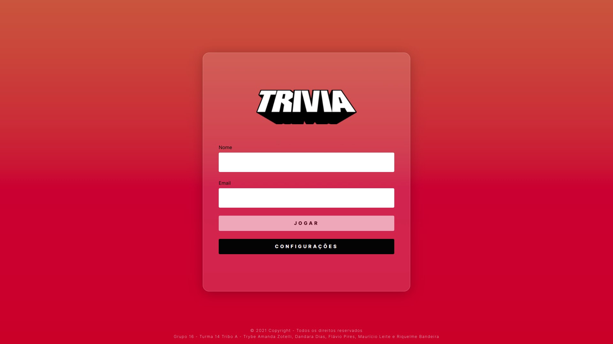

# Projeto Trivia

# Contexto
Este projeto é um jogo de perguntas e respostas, baseado no jogo Trivia, feito com React e Redux e abastecido pela API do Open Trivia Database.



## Tecnologias usadas

* React
* Redux

## Instalando o projeto

1. Clone o repositório:

```
git clone git@github.com:riquelmebandeira/projeto-trivia.git
```

2. Entre na pasta do repositório clonado:

```
cd projeto-trivia
```

3. Instale as dependências com o comando:

```
npm install
```

## Executando a aplicação

  ```
  npm start